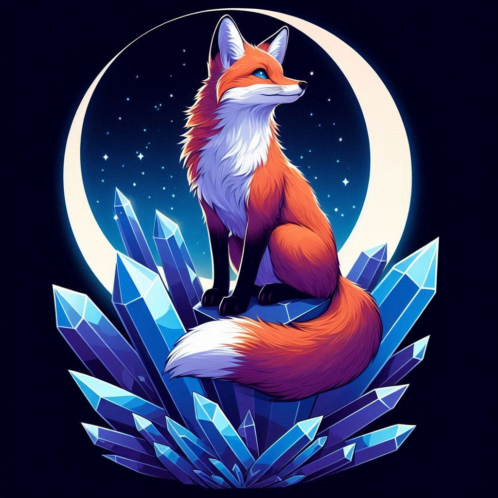

# ⏬ Cobalt Fox 🦊
### save what you love, powered by [cobalt](https://github.com/imputnet/cobalt), free forever

## Why?
I wanted to create a bot that makes sharing so much easier. I often download stuff over cobalt only to reupload it somewhere on Telegram. I wanted to streamline this process and Cobalt Fox was born.

## How?
I'm using a self-hosted instance of [cobalt](https://github.com/imputnet/cobalt) and [zipline](https://zipline.diced.sh) for large files. With that I bypass some API limits and take care of storage on my own cluster.

## What about logs?
Look, I don't care if you listen to Mariah Carey off season or enjoy hardcore X (formerly Twitter) porn. I'm just logging details if something goes horribly, ***horribly*** wrong. I don't see your username unless the bot decides it doesn't like sending messages to you. Everything else is caught before.

## Ethics
Cobalt Fox is - just like cobalt - a tool that makes downloading public content easier. It takes zero liability. The end user is responsible for what they download, how they use and distribute that content. Due to the way Telegram works, Cobalt Fox has to cache content before uploading it, but will immediately dispose of the files locally. 

Cobalt Fox is in no way a piracy tool and cannot be used as such. It can only download free & publicly accessible content. Same content can be downloaded via dev tools of any modern web browser.

The image used as the profile picture of the bot has been generated with bing.com/create. This is merely a temporary solution until a "good" image comes around. I do not encourage nor condemn the use of such generators.